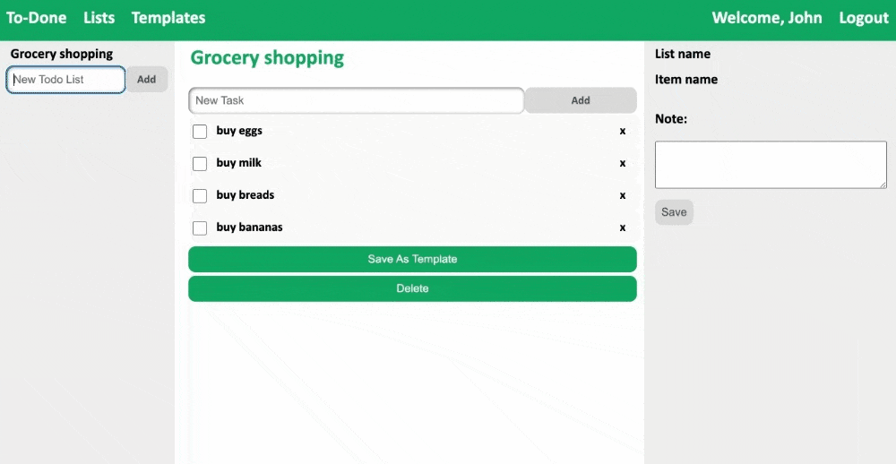
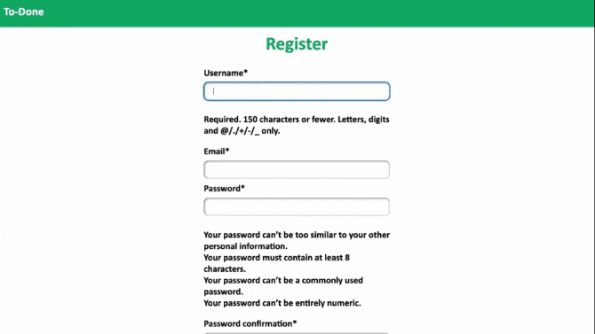
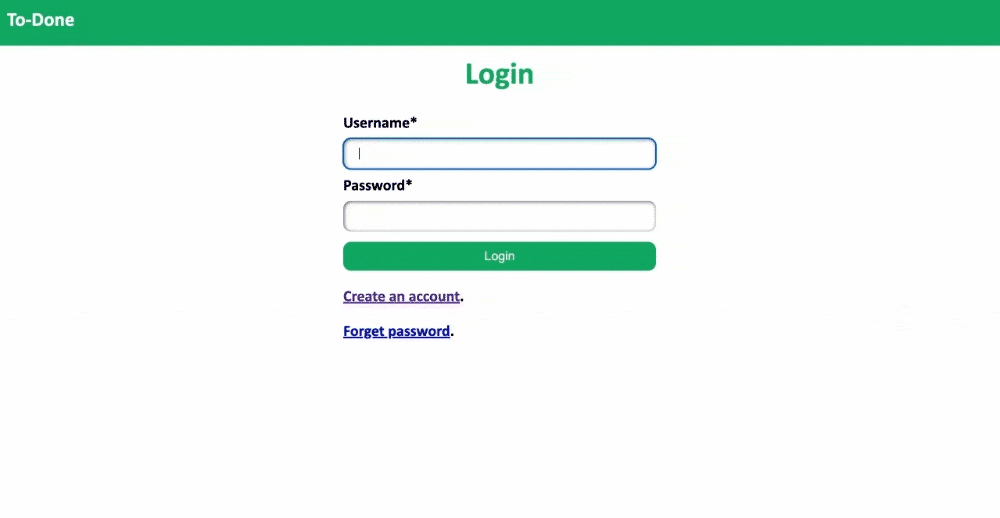
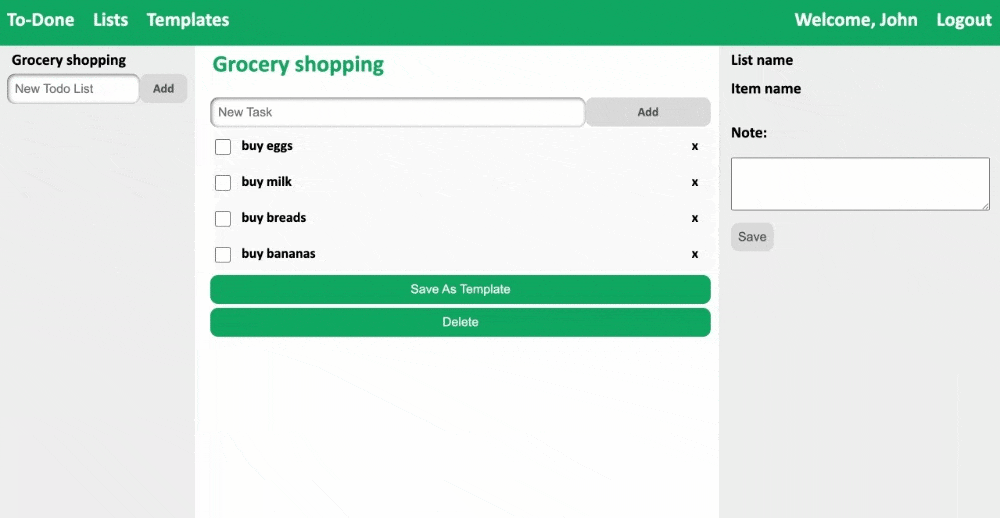
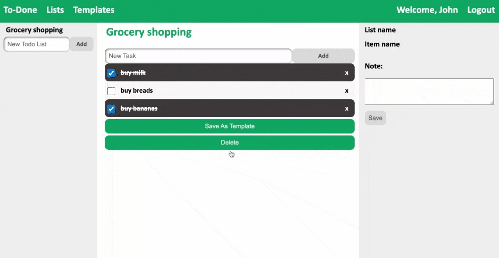

<p align="center">
  
</p>
<h2 align="center">The Only Todo List You Need</h2>

[](https://github.com/shahleon/smart-todo/actions/workflows/django.yml)
[](https://coveralls.io/github/shahleon/smart-todo?branch=main)
[](https://github.com/shahleon/smart-todo/blob/main/LICENSE)
[](https://github.com/shahleon/smart-todo/issues)
[](https://www.python.org/downloads/release/python-380/)
[](https://docs.djangoproject.com/en/4.1/releases/4.1/)
[](https://doi.org/10.5281/zenodo.7155415)

# TO-DONE

`to-done` lets you manage your todo list effectively with minimal effort. With a minimalistic web interface, 
you can access your todolist on the go. Use our rich library of templates to create a new todo list very fast or create your own.



Contents
========

 * [Why?](#why)
 * [Features](#key-features)
 * [Upcoming Features](#upcoming-features)
 * [Quick Start](#quick-start)
 * [Documentation](#Documentation)
 * [Want to contribute?](#want-to-contribute)
 * [License](#license)
 * [Developer](#developers)

### Why?

We wanted to work on something that is:

+ Useful, serves some real purpose
+ Easy to start with a basic working version and lends itself to adding new features incrementally to it
+ Easily divisible in modules/features/tasks that can be parallely done by five developers 
+ Diverse enough so that a lot of Software Engineering practices is required/involved 

`to-done` is a todo list app that is actually useful, very easy to create a basic working version with where a ton of new features can be added, touches upon all the aspects of web programming, database, working in a team etc.

### Key Features (Last Version)
 * [Register](#register)
 * [Login](#login-forget-password)
 * [Create, Update, Delete Todo Lists](#manage-todo-list)
 * [Quickly Create Todo Lists From Existing Templates](#templates)
 * [Create Your Own Templates](#templates)

### New Features
* [Shared List]
* [Add Due Date To Tasks]
* [Due Date Alerting Mechanism]
* [Add Reminder Message to completed]
* [Customized Color Tag]
* [Add Tags To Todo Lists For Customizable Grouping]

### Upcoming Features
 * Social login
 * Export and import to-do lists
 * Gamification - earn points by finishing your tasks, show-off your productivity in social media
 * [List of All Planned Features for Second Phase](https://github.com/users/shahleon/projects/2/views/6)

### Quick Start

 * [Download](https://www.python.org/downloads/release/python-380/) and install Python 3.8.0 or higher
 * [Install](https://docs.djangoproject.com/en/4.1/topics/install/) Django 4.1
 * Clone the repository
    ```bash
    $ git clone git@github.com:shahleon/smart-todo.git
    ```
 * Run migrations
    ```bash
    $ cd smarttodo
    $ python manage.py migrate
    ```
 * Start the app
    ```bash
    $ python manage.py runserver 8080
    ```
 * Point your browser at http://127.0.0.1:8080 and explore the app

### Documentation
[See this page](https://shahleon.github.io/smart-todo/)

### Features

#### Register
<p float="middle">
    
</p>

#### Login, Forget Password
<p float="middle">
     
</p>

#### Manage Todo List
<p float="middle">
    
    <br>
    <br>
    
</p>

#### Templates
<p float="middle">
    
</p>

### Want to Contribute?

Want to contribute to this project? Learn about [Contributing](CONTRIBUTING.md). Not sure where to start? Have a look at 
the [good first issue](https://github.com/shahleon/smart-todo/issues?q=is%3Aissue+is%3Aopen+label%3A%22good+first+issue%22). Found a bug or have a new feature idea? Create an [Issue](https://github.com/shahleon/smart-todo/issues/new) or shoot a mail to [us](#developers)

### License

Distributed under the MIT License. See [LICENSE](License) for more information.

### Developers (New Version)

<table>
  <tr>
    <td align="center"><a href="https://github.com/juliachiu1"><br /><sub><b>Chiu, Ching-Lun</b></sub></a></td>
    <td align="center"><a href="https://github.com/Hsueh-YANG"><br /><sub><b>Yu, Hsueh-Yang</b></sub></a><br /></td>
    <td align="center"><a href="https://github.com/123standup"><br /><sub><b>Lin, Po-Hsun</b></sub></a><br /></td>
    <td align="center"><a href="https://github.com/Chloe-Ku"><br /><sub><b>Ku, Li-Ling</b></sub></a><br /></td>
    <td align="center"><a href="https://github.com/jackson910210"><br /><sub><b>Chiang, Chen-Hsuan</b></sub></a><br /></td>
  </tr>
</table>

### Developers (Last Version)

* Shahnewaz Leon (sleon3@ncsu.edu)
* Dong Li (dli35@ncsu.edu)
* Cheng-Yun Kuo (ckuo3@ncsu.edu)
* Drew Commings (docummin@ncsu.edu)
* Janet Brock (jdbrock@ncsu.edu)
